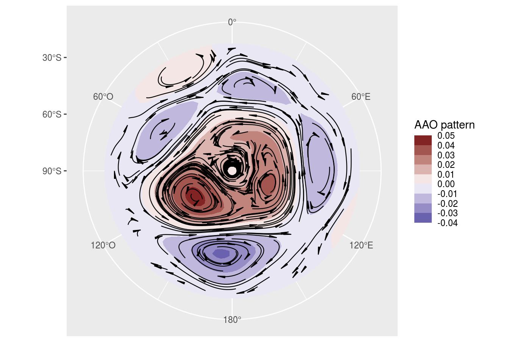
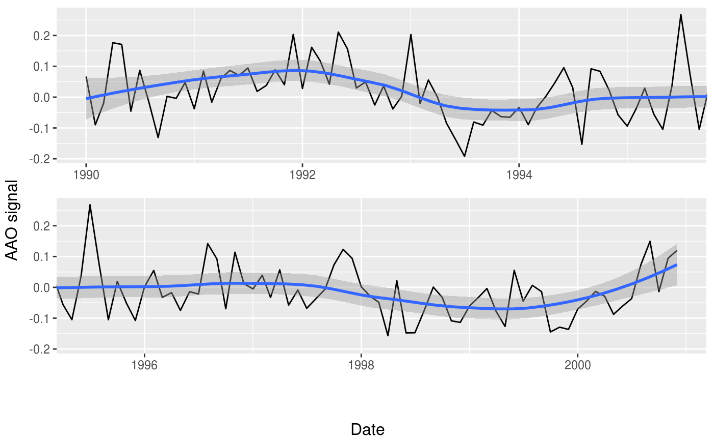

<!-- README.md is generated from README.Rmd. Please edit that file -->
metR
====

[](https://travis-ci.org/eliocamp/metR) [](https://www.tidyverse.org/lifecycle/#experimental) [](https://codecov.io/github/eliocamp/metR/?branch=master) [](https://cran.r-project.org/package=metR)

meteR packages several functions and utilities that make R better for hadling<sup>1</sup> meteorological data in the tidy data paradigm. It's not intended to be the be-all and end-all and is (at least for now) mostly a packaging of assorted wrapers and tricks that I wrote for my day to day work as a researcher in atmospheric sciences. Since it's grown organically and for my own needs, do not expect a heavy emphasis on consistency across functions and do expect functions written with specific use cases in mind.

Conceptually it's divided into *visualization tools* and *data tools*. The former are geoms, stats and scales that help with plotting using [ggplot2](http://ggplot2.tidyverse.org/index.html), such as `stat_contour_fill()` or `scale_y_level()`, while the later are functions for common data processing tools in the atmospheric sciences, such as `Derivate()` or `EOF()`; these are implemented to work in the [data.table](https://github.com/Rdatatable/data.table/wiki) paradigm, but also work with regular data frames.

Currently metR is in developement and should only be used carefully (or better still, not at all). Functions do not generaly check arguments and do not print error messages. There are also few if any tests, so coverage is roughly 0%.

<sup>1</sup>handling data, [Hadley](https://twitter.com/hadleywickham/) style.

Installation
------------

You can install metR from github with:

``` r
# install.packages("devtools")
devtools::install_github("eliocamp/metR")
```

You might need to install the netcdf and udunits2 libraries. On Ubuntu and it's derivatives this can be done by typing

    sudo apt install libnetcdf-dev netcdf-bin libudunits2-dev

Examples
--------

In this example we easily perform Principal Components Decomposition (EOF) on monthly geopotential height, then compute the geostrophic wind associated with this field and plot the field with filled contours and the wind with streamlines.

``` r
library(metR)
library(data.table)
library(ggplot2)
data(geopotential)
# Use Empirical Orthogonal Functions to compute the Antarctic Oscillation
geopotential <- copy(geopotential)
geopotential[, gh.t.w := Anomaly(gh)*sqrt(cos(lat*pi/180)),
      by = .(lon, lat, month(date))]
aao <- EOF(gh.t.w ~ lat + lon | date, data = geopotential, n = 1)
aao$left[, c("u", "v") := GeostrophicWind(gh.t.w, lon, lat)]

# AAO field
binwidth <- 0.01
ggplot(aao$left, aes(lon, lat, z = gh.t.w)) +
    geom_contour_fill(binwidth = binwidth, circular = "x") +    # filled contours!
    geom_streamline(aes(dx = dlon(u, lat), dy = dlat(v)), 
                    size = 0.4, L = 80, skip = 3, circular = "x") +
    scale_x_longitude() +
    scale_y_latitude(limits = c(-90, -20)) +
    scale_fill_divergent(name = "AAO pattern", 
                         breaks = MakeBreaks(binwidth),
                         guide = guide_colorstrip()) +
    coord_polar()
```



``` r
# AAO signal
g <- ggplot(aao$right, aes(date, gh.t.w)) +
    geom_line() +
    geom_smooth(span = 0.4)

DivideTimeseries(g, aao$right$date, xlab = "Date", ylab = "AAO signal")
#> `geom_smooth()` using method = 'loess' and formula 'y ~ x'
#> `geom_smooth()` using method = 'loess' and formula 'y ~ x'
#> `geom_smooth()` using method = 'loess' and formula 'y ~ x'
```



You can read more in the vignettes (comming soon).
