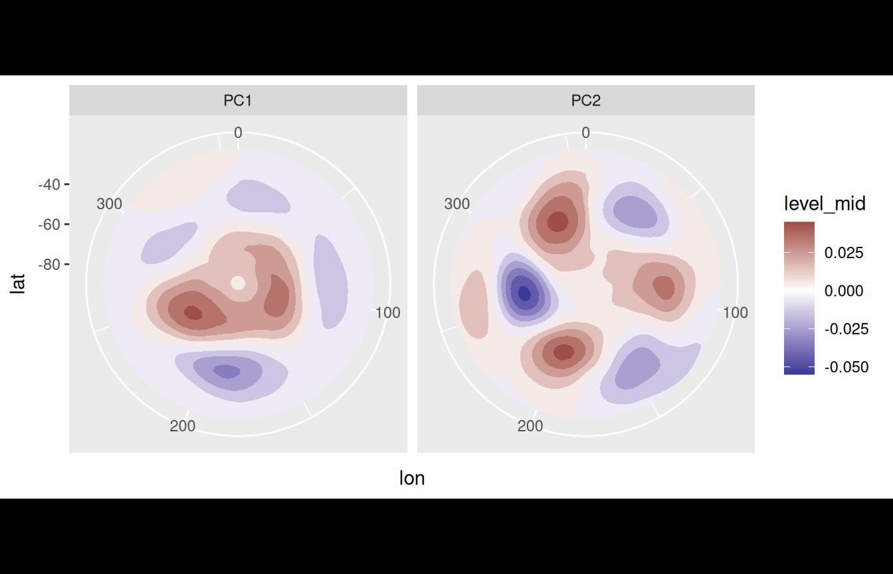
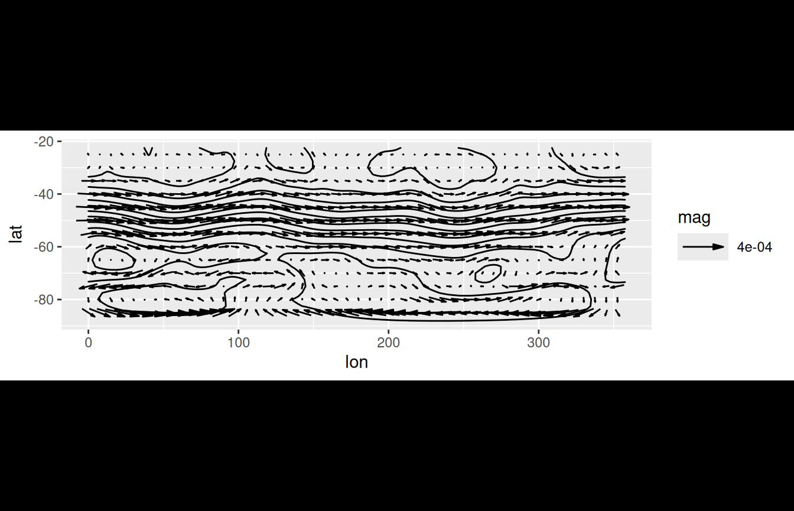

# Working with data

## Getting data

`metR` implements some functions to easily load data into R either from
local files or from remote locations.

### ReadNetCDF

The function
[`ReadNetCDF()`](https://eliocamp.github.io/metR/reference/ReadNetCDF.md)
relies on the `ncdf4` package to read NetCDF files with ease. It
intelligently reads dimensions and data and returns a tidy `data.table`
with optional keyed columns for faster processing afterwards. It can
also return an `array` with named dimensions or a `vector`, for the case
of adding new columns to an existing `data.table`.

``` r
library(metR)
library(data.table)
library(ggplot2)

# If out = "vars", returns information about the available variables and 
# dimensions
file <- system.file("extdata", "temperature.nc", package = "metR")
GlanceNetCDF(file)
#> ----- Variables ----- 
#> air:
#>     mean Daily Air temperature in degK
#>     Dimensions: lon by lat by level by time
#> 
#> 
#> ----- Dimensions ----- 
#>   time: 1 values from 2010-07-09 to 2010-07-09 
#>   level: 17 values from 10 to 1000 millibar
#>   lat: 73 values from -90 to 90 degrees_north
#>   lon: 144 values from 0 to 357.5 degrees_east
```

Now that we know the name and the dimensions of the data, we can read
it.
[`ReadNetCDF()`](https://eliocamp.github.io/metR/reference/ReadNetCDF.md)
can also read only a (continuous) subset of the data.

``` r
air <- ReadNetCDF(file, subset = list(lat = 90:0, level = 925))


ggplot(air, aes(lon, lat)) +
  geom_contour2(aes(z = air, color = after_stat(level)))
```


Since the most consuming part of reading the file is melting a
multidimensional array into a tidy `data.table`, if we wanted to add
another variable to the same `data.table` we could save time by only
returning a vector. **It is of the utmost importance that both variables
are on the same exact grid**.

``` r
air[, air2 := ReadNetCDF(file, out = "vector",
                         subset = list(lat = 90:0, level = 300))]

ggplot(air, aes(lon, lat)) +
  geom_contour2(aes(z = air2, color = after_stat(level)))
```


Because
[`ReadNetCDF()`](https://eliocamp.github.io/metR/reference/ReadNetCDF.md)
can read multiple variables at the same time, the `out = "vector"`
output will be actually return a `list` of vectors (which integrates
seamlessly with the `data.table` syntax). If one of the variables has
degenerate dimensions (dimensions of length 1) then it will be recycled.
That means that if the same file has Sea Surface Temperatures (a 2D
field) and Air Temperature (a 3D field), then the returned `data.table`
fill have an observation of Air Temperature *and* Sea Surface
Temperature for each vertical level.

The netCDF format is very flexible and this function has not been tested
on every possible file so things may break in strange cases. If you have
a file that cannot be read with this function, please [submit an
issue](https://github.com/eliocamp/metR/issues).

### GetTopography

[`GetTopography()`](https://eliocamp.github.io/metR/reference/GetTopography.md)
retrieves topographic data from the ETOPO1 Global Relief Model into a
convenient tidy `data.table`. By default, it also stores a cached
version.

As an example, let’s look at a global relief map at 1/2° resolution with
some ugly colour palette.

``` r
# Not run because it needs internet access
# world <- GetTopography(0, 360, 90, -90, resolution = 1)

# ggplot(world, aes(lon, lat)) +
#     geom_raster(aes(fill = h/1000)) +
#     geom_contour2(aes(z = h), breaks = 0, color = "black", size = 0.5) +
#     coord_fixed(expand = FALSE) +
#     scale_fill_gradientn(colors = topo.colors(6)[c(1, 2, 3, 4, 6)], 
#                          values = scales::rescale(c(-11, 0, 0, 2, 7)),
#                          guide = "none") +
#     theme_void()
```

### MaskLand

Related to this problem,
[`MaskLand()`](https://eliocamp.github.io/metR/reference/MaskLand.md)
returns a logical vector with `TRUE` if a point is over land.

``` r
air[, land := MaskLand(lon, lat)]

ggplot(air, aes(lon, lat)) +
  geom_tile(aes(fill = land)) +
  coord_quickmap()
```


With this, we can compare mean temperature over land and over sea by
latitude.

``` r
ggplot(air[, .(air = mean(air) - 273.15), by = .(lat, land)],
       aes(lat, air)) +
  geom_line(aes(color = land))
```


The resolution of
[`MaskLand()`](https://eliocamp.github.io/metR/reference/MaskLand.md)
is, in principle, only limited by the polygons used as mask. Currently
it can only use maps from the `maps` package (see
[`?maps::map`](https://rdrr.io/pkg/maps/man/map.html)).

## Manipulate data

### EOF

Empirical Orthogonal Functions (also known as Principal Component
Analysis) is a widely use technique for dimensional reduction of large
datasets. In R there are multiple packages that implement this
methodology (in fact, base R has *two* functions) but, IMHO, they have
awkward interfaces that don’t interact well with `data.table` (or
`dplyr`) syntax. `metR`’s
[`EOF()`](https://eliocamp.github.io/metR/reference/EOF.md) essentially
performs a Singular Value Decomposition of the data and returns the left
and right singular vectors, and singular values in a tidy format.

``` r
data(geopotential)
# Weigthed geopotential anomaly
geopotential[, gh.t.w := Anomaly(gh)*sqrt(cos(lat*pi/180)), by = .(lon, lat, month(date))]

eof <- EOF(gh.t.w ~ date | lon + lat, data = geopotential, n = 1:2)
str(eof)
#> List of 3
#>  $ left :Classes 'data.table' and 'data.frame':  144 obs. of  3 variables:
#>   ..$ date  : Date[1:144], format: "1990-01-01" "1990-02-01" ...
#>   ..$ PC    : Ord.factor w/ 2 levels "PC1"<"PC2": 1 1 1 1 1 1 1 1 1 1 ...
#>   ..$ gh.t.w: num [1:144] 0.0633 -0.1145 -0.0432 0.1926 0.1539 ...
#>   ..- attr(*, ".internal.selfref")=<externalptr> 
#>  $ right:Classes 'data.table' and 'data.frame':  8064 obs. of  4 variables:
#>   ..$ lon   : num [1:8064] 0 2.5 5 7.5 10 12.5 15 17.5 20 22.5 ...
#>   ..$ lat   : num [1:8064] -22.5 -22.5 -22.5 -22.5 -22.5 -22.5 -22.5 -22.5 -22.5 -22.5 ...
#>   ..$ PC    : Ord.factor w/ 2 levels "PC1"<"PC2": 1 1 1 1 1 1 1 1 1 1 ...
#>   ..$ gh.t.w: num [1:8064] 2.32e-04 4.67e-06 -1.17e-04 -1.47e-04 -1.12e-04 ...
#>   ..- attr(*, ".internal.selfref")=<externalptr> 
#>  $ sdev :Classes 'data.table' and 'data.frame':  2 obs. of  3 variables:
#>   ..$ PC: Ord.factor w/ 2 levels "PC1"<"PC2": 1 2
#>   ..$ sd: num [1:2] 7050 4228
#>   ..$ r2: num [1:2] 0.318 0.114
#>   ..- attr(*, ".internal.selfref")=<externalptr> 
#>  - attr(*, "call")= language EOF(formula = gh.t.w ~ date | lon + lat, n = 1:2, data = geopotential)
#>  - attr(*, "class")= chr [1:2] "eof" "list"
#>  - attr(*, "suffix")= chr "PC"
#>  - attr(*, "value.var")= chr "gh.t.w"
#>  - attr(*, "engine")=function (A, nv, nu)
```

In the returned list of `data.table`s the left (right) singular vectors
are fields defined with the dimensions on the left (right) hand of the
formula. In this case, the right `data.table` holds spatial fields and
the left `data.table` holds a timeseries. If the order of the right hand
side and left hand side of the formula are reversed, and
`rotate == FALSE`, then the result is the same. Rotation of the singular
vectors is perform via
[`stats::varimax()`](https://rdrr.io/r/stats/varimax.html) and perform
from the (scaled) right singular vector.

For completion, let’s plot each Principal Component.

``` r
ggplot(eof$right, aes(lon, lat)) +
  geom_contour_fill(aes(z = gh.t.w), binwidth = 0.01) +
  scale_fill_divergent() +
  coord_polar() +
  facet_wrap(~PC) 
```



``` r

ggplot(eof$left, aes(date, gh.t.w)) +
  geom_line(aes(color = PC)) +
  scale_x_date(expand = c(0, 0))
```


Where the 1st Principal Component is clearly the [Antarctic
Oscillation](http://www.cpc.ncep.noaa.gov/products/precip/CWlink/daily_ao_index/aao/aao.smd)
and the 2nd Principal Component looks like the Pacific–South American
Pattern.

### ImputeEOF

As shown above,
[`EOF()`](https://eliocamp.github.io/metR/reference/EOF.md) needs a
complete data matrix. Imputing missing values is a huge problem on it’s
own with a lot of different algorithms. `metR` offers
[`ImputeEOF()`](https://eliocamp.github.io/metR/reference/ImputeEOF.md),
which is an implementation of the
[DINEOF](https://doi.org/10.12681/mms.64) algorithm for imputation of
missing data. Its interface is similar to that of
[`EOF()`](https://eliocamp.github.io/metR/reference/EOF.md) but it
returns a vector of imputed values.

``` r
geopotential <- geopotential[]
geopotential[sample(1:.N, .N*0.8), gh.na := gh]

geopotential[, imputed := ImputeEOF(gh.na ~ lon + lat | date, max.eof = 5)]
str(geopotential)
#> Classes 'data.table' and 'data.frame':   290304 obs. of  8 variables:
#>  $ lon    : num  0 2.5 5 7.5 10 12.5 15 17.5 20 22.5 ...
#>  $ lat    : num  -22.5 -22.5 -22.5 -22.5 -22.5 -22.5 -22.5 -22.5 -22.5 -22.5 ...
#>  $ lev    : int  700 700 700 700 700 700 700 700 700 700 ...
#>  $ gh     : num  3164 3163 3162 3162 3163 ...
#>  $ date   : Date, format: "1990-01-01" "1990-01-01" ...
#>  $ gh.t.w : num  -3.82 -3.59 -2.86 -2.4 -2.07 ...
#>  $ gh.na  : num  3164 3163 3162 3162 3163 ...
#>  $ imputed: num  3164 3163 3162 3162 3163 ...
#>   ..- attr(*, "eof")= int 5
#>   ..- attr(*, "rmse")= num 26.6
#>  - attr(*, ".internal.selfref")=<externalptr>
```

The imputed vector is returned along with the Root Mean Square Error
estimated from cross-validation and the number of EOFs used in the
imputation as attributes. In this case, with 5 EOFs the imputed values
have an estimated rmse of 26.65.

### Interpolate

[`Interpolate()`](https://eliocamp.github.io/metR/reference/Interpolate.md)
performs linear interpolation using a `data.table`-friendly syntax. It
can be used to a new grid or to add interpolated values to an existing
grid. It’s easy to interpolate multiple values with the formula
interface.

``` r
# new grid
x.out <- seq(0, 360, by = 10)
y.out <- seq(-90, 0, by = 10)

interpolated <- geopotential[, Interpolate(gh | gh.t.w ~ lon + lat, x.out, y.out), 
                             by = date]
```

To add interpolated values to an existing `data.table` use
`grid = FALSE`.

``` r
geopotential[, gh.new := Interpolate(gh ~ lon + lat, lon, lat, 
                                     data = interpolated[date == d],
                                     grid = FALSE)$gh, 
             by = .(d = date)]
```

## Physics

### Derivates

Derivation is the bread and butter of the researcher so
[`Derivate()`](https://eliocamp.github.io/metR/reference/Derivate.md)
offers a convenient interface for derivation using finite differences of
multidimensional data. It has support for cyclical boundary conditions
and for the special case of spherical coordinates (think: Earth).

``` r
geopotential[date == date[1],    # think: gh as a function of lon and lat
             c("gh.dlon", "gh.dlat") := Derivate(gh ~ lon + lat, 
                                                 cyclical = c(TRUE, FALSE), 
                                                 sphere = TRUE)]


ggplot(geopotential[date == date[1]], aes(lon, lat)) +
  geom_contour_fill(aes(z = gh)) +
  geom_vector(aes(dx = gh.dlon, dy = gh.dlat), skip = 2) +
  scale_mag() +
  coord_quickmap()
```


There are several wrappers around
[`Derivate()`](https://eliocamp.github.io/metR/reference/Derivate.md) to
perform other common related operations,
[`Laplacian()`](https://eliocamp.github.io/metR/reference/Derivate.md),
[`Divergence()`](https://eliocamp.github.io/metR/reference/Derivate.md)
and
[`Vorticity()`](https://eliocamp.github.io/metR/reference/Derivate.md).

### GeostrophicWind

Finally, the function
[`GeostrophicWind()`](https://eliocamp.github.io/metR/reference/GeostrophicWind.md)
computes geostrophic wind from geopotential height.

``` r
geopotential[date == date[1], c("u", "v") := GeostrophicWind(gh, lon, lat)]

ggplot(geopotential[date == date[1]], aes(lon, lat)) +
  geom_contour2(aes(z = gh)) +
  geom_vector(aes(dx = dlon(u, lat), dy = dlat(v)), 
              skip.y = 1, skip.x = 2) +
  scale_mag() +
  coord_quickmap()
```



### Thermodynamics

`metR` offers several functions related to thermodynamical processes in
the atmosphere (see
[`?thermodynamics`](https://eliocamp.github.io/metR/reference/thermodynamics.md)).
These are
[`IdealGas()`](https://eliocamp.github.io/metR/reference/thermodynamics.md),
[`Adiabat()`](https://eliocamp.github.io/metR/reference/thermodynamics.md),
[`VirtualTemperature()`](https://eliocamp.github.io/metR/reference/thermodynamics.md),
[`MixingRatio()`](https://eliocamp.github.io/metR/reference/thermodynamics.md),
[`ClausiusClapeyron()`](https://eliocamp.github.io/metR/reference/thermodynamics.md)
and
[`DewPoint()`](https://eliocamp.github.io/metR/reference/thermodynamics.md).
Each function represents a different physical relationship between
variables and computes one of them from the others.

For example,
[`IdealGas()`](https://eliocamp.github.io/metR/reference/thermodynamics.md)
uses the ideal gas law to compute pressure, temperature or density.

``` r
# Density of air at 20°C and 1030hPa.
(rho <- IdealGas(1013*100, 20 + 273.15))
#> [1] 1.203788

# Of course, the temperature of air at that density 
# and same pressure is 20°C.
IdealGas(1013*100, rho = rho) - 273.15
#> [1] 20
```

Different variables can be derived by combining these functions. For
example, it’s easy to calculate relative humidity from data on
temperature and dewpoint, then saturation mixing ratio from pressure and
temperature and finally the actual mixing ratio.

``` r
# Relative humidity from T and Td
t <- 25 + 273.15
td <- 20 + 273.15
p <- 1000000
(rh <- ClausiusClapeyron(td)/ClausiusClapeyron(t))
#> [1] 0.7380251

# Mixing ratio
ws <- MixingRatio(p, ClausiusClapeyron(t))
(w <- ws*rh)
#> [1] 0.001456004
```

Of course, `w` can be also be computed by `DewPoint(p, td = td)` which
gives essentially the same result: 0.0014548.
